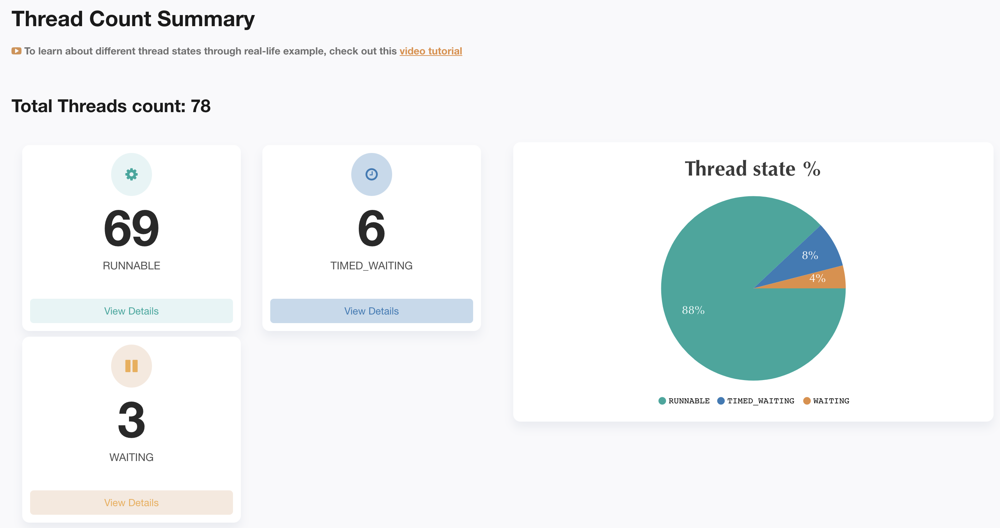
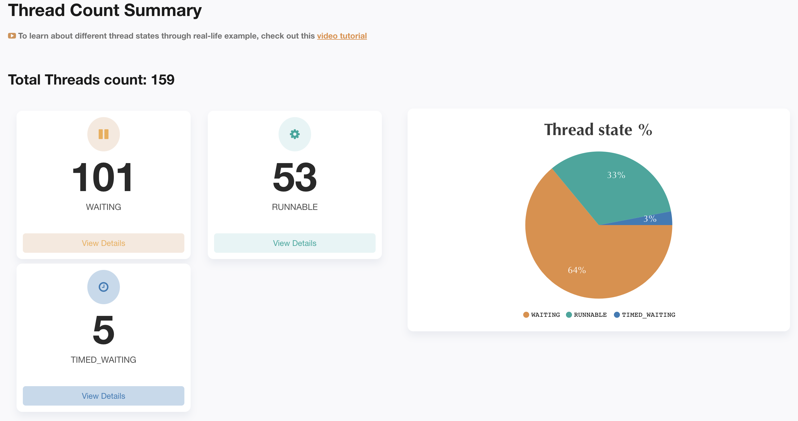

== Intro to reactive programing

=== Agenda

* Reactive intro

* Mono vs Flux basic and operators

* Person API overview

* WebMVC vs WebFlux "performance tests"
+

+

=== Resources

* https://www.amitph.com/introduction-spring-webflux-reactive-api/
* https://docs.spring.io/spring-framework/docs/current/reference/html/web-reactive.html
* https://projectreactor.io/docs/core/release/reference/
* https://jstobigdata.com/java/transform-and-combine-reactive-stream/
* https://www.baeldung.com/spring-webflux-concurrency
* https://www.baeldung.com/reactive-streams-step-verifier-test-publisher
* https://www.vinsguru.com/reactor-flux-create-vs-generate/
* https://stackoverflow.com/questions/52244808/backpressure-mechanism-in-spring-web-flux
* https://www.codingame.com/playgrounds/929/reactive-programming-with-reactor-3/transform
* https://nikeshshetty.medium.com/5-common-mistakes-of-webflux-novices-f8eda0cd6291